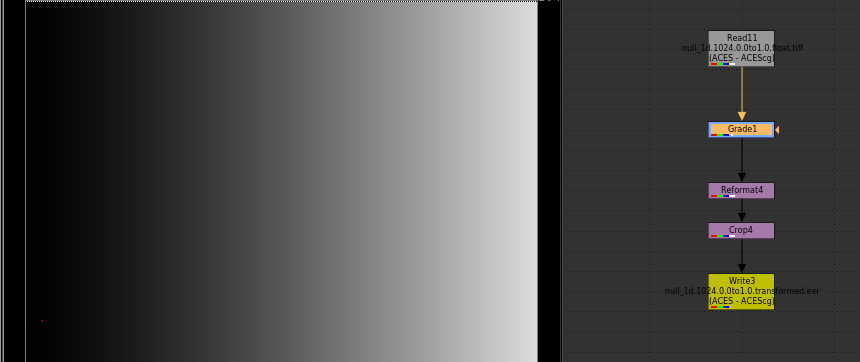
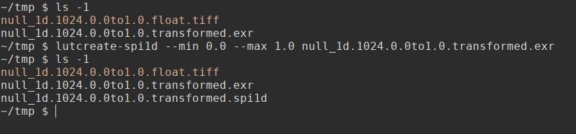
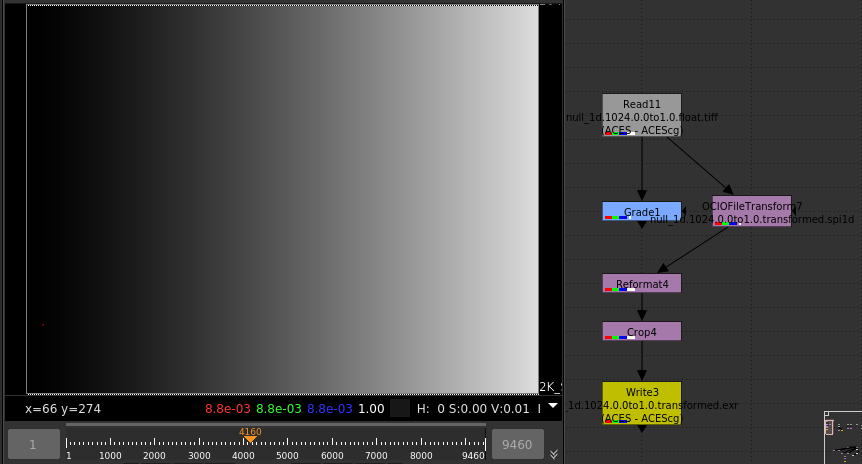

# SPI LUT Generator
SPI LUT Generator is a set of simple commandline tools to create spi1d and spi3d lut files. It utilizes the [ACES 1.0.3 python](https://github.com/imageworks/OpenColorIO-Configs/tree/master/aces_1.0.3/python) code.

# Dependencies
- OpenColorIO
- OpenImageIO >= 2.0

# Documentation
## spi1d
spi1d is a 1 dimensional lut format. An spi1d file contains a lookup table mapping input values to output values for 3 color channels. It can describe simple color and luminance transformations, but not more complex gamut mapping or hue transformations. It is usually used to describe log space curves.

The workflow is to first create a null image using the `lutcreate-nullimage1d` tool. This image will be a ramp of a certain resolution. By default this is a 4096x1 linear ramp from min_value to max_value. Then you can process this image in whatever software you want and output a transformed image as an exr file. You would then use `lutcreate-spi1d` tool to process your transformed image into an spi1d file.

## spi3d
The workflow is the same for an spi3d lut except that instead of a ramp you will be creating a more complex lattice to apply the color transformation to. First use the `lutcreate-nullimage3d` tool to create a source image. Then transform this image using your software of choice. Then use the `lutcreate-spi3d` tool to convert your processed exr into an spi3d lut.

## Walkthrough with Pictures
Here is a walkthrough with some pictures. Note that this overrides the default min and max values and the resolution so you can see how that works. This is not necessary if you want to use the default resolution and range which is 4096 and min_value=-0.358400, max_value=1.468000.

